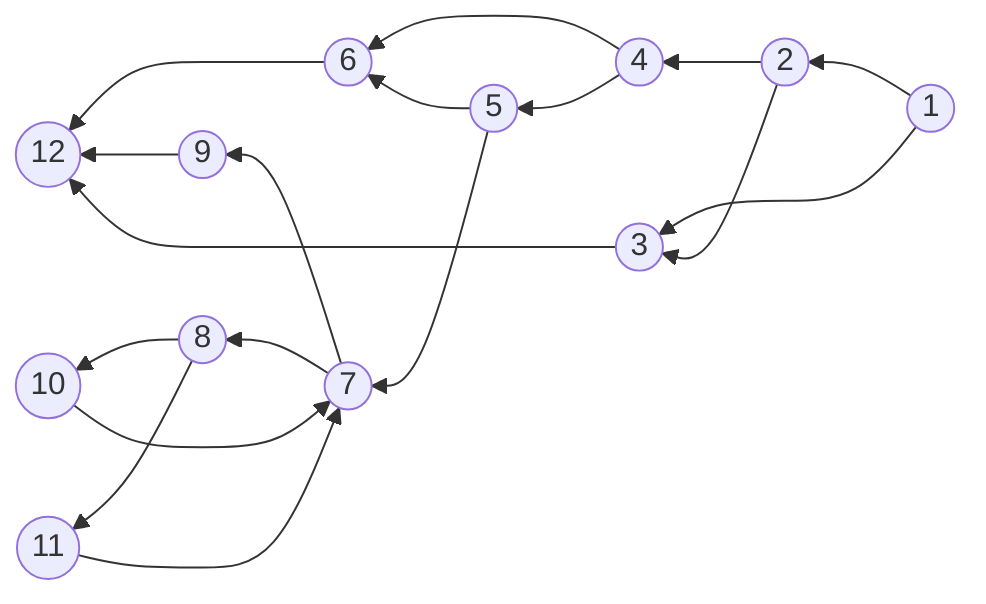
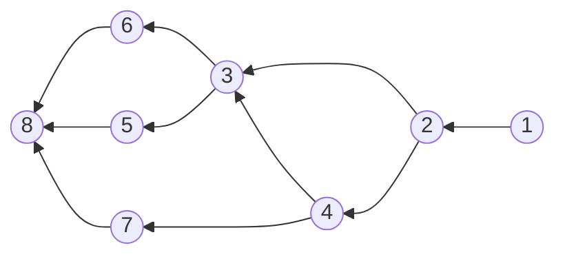

# Caja-blanca

## grafo de MCD

```mermaid
graph RL
    A((1))
    B((2))
    C((3))
    D((4))
    E((5))
    F((6))
    G((7))
    H((8))
    I((9))
    J((10))
    K((11))
    L((12))

    A --> B
    A --> C
    B --> C
    B --> D
    D --> F
    D --> E
    E --> F
    E --> G
    G --> H
    G --> I
    H --> J
    H --> K
    J --> G
    K --> G
    F --> L
    I --> L
    C --> L


```

## grafo de Número Máximo

```mermaid
graph RL
    A((1))
    B((2))
    C((3))
    D((4))
    E((5))
    F((6))
    G((7))
    H((8))

    A --> B
    B --> C
    B --> D
    C --> E
    D --> C
    D --> G
    C --> F
    F --> H
    E --> H
    G --> H

```
