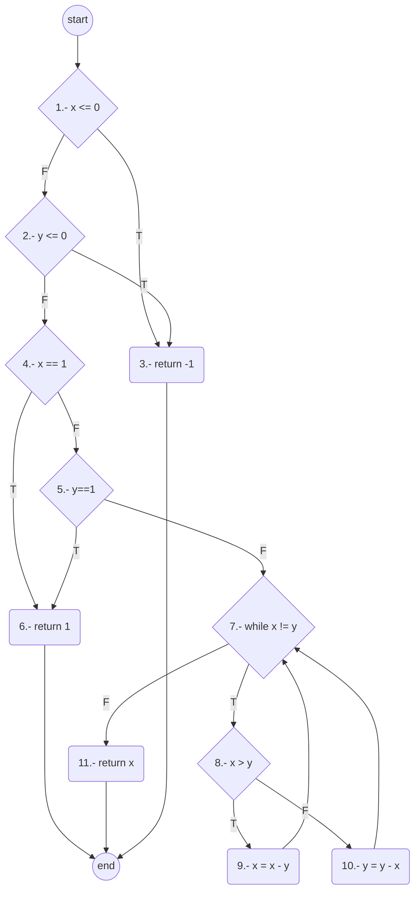
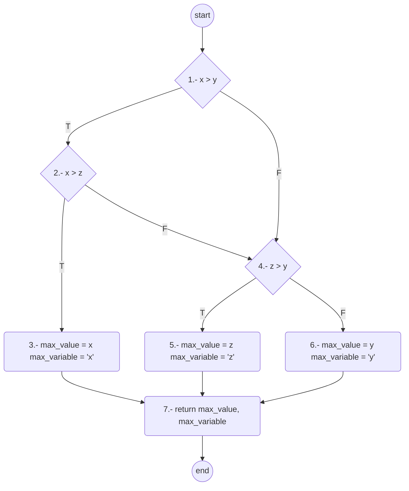

# Caja-blanca

## Maximo Comun Divisor

V(G) = a - n + 2 = 18 - 13 + 2 = 7

V(G) = r = 7

V(G) = c + 1 = 6 + 1 = 7

|Caminos|TCs|Entradas|Resultado esperado|
|--------|-------|--------|-------|
|1,3|TC1|x=0, y=1|-1|
|1,2,3|TC2|x=1, y=0|-1|
|1,2,4,6|TC3|x=1, y=2|1|
|1,2,4,5,6|TC4|x=2, y=1|1|
|1,2,4,5,7,11|TC5|x=2, y=2|2|
|1,2,4,5,7,8,9,7,8,9,11|TC6|x=6, y=2|2|
|1,2,4,5,7,8,10,7,8,10,11|TC7|x=2, y=6|2|

## Numero Máximo

V(G) = a - n + 2 = 11 - 9 + 2 = 4

V(G) = r = 4

V(G) = c + 1 = 3 + 1 = 4

|Caminos|TCs|Entradas|Resultado esperado|
|--------|-------|--------|-------|
|1,2,3,7|TC1|x=3, y=2, z=1|3, 'x'|
|1,4,5,7|TC2|x=1, y=2, z=3|3, 'z'|
|1,4,6,7|TC3|x=1, y=3, z=2|3, 'y'|
|1,2,4,5,7|TC4|x=2, y=2, z=3|3, 'z'|
